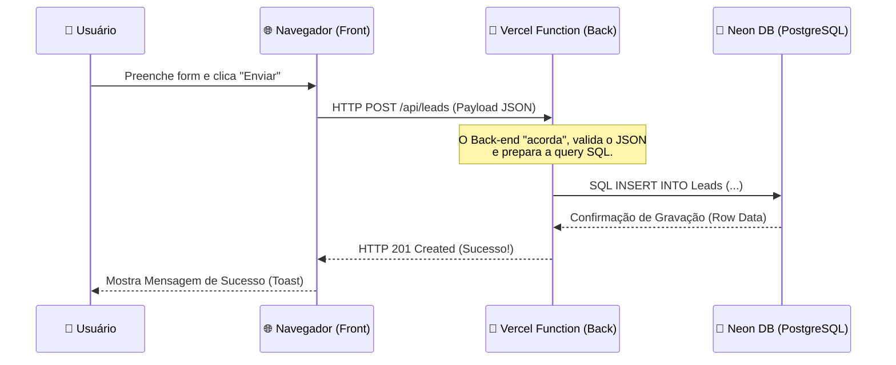

# 🚀 LeadFlow Pro - Premium Lead Management System


**LeadFlow Pro** é uma solução completa de CRM (Customer Relationship Management) projetada para demonstrar como aplicações modernas de alta performance funcionam na nuvem.

---

## 🏗️ Arquitetura do Sistema (Full Stack)

Diferente de sistemas estáticos, este projeto utiliza uma arquitetura de três camadas (**3-Tier Architecture**), garantindo segurança e escalabilidade.

### 1. Front-end (Camada de Cliente)
*   **Onde vive**: No navegador do usuário (Chrome, Safari, etc).
*   **Tecnologias**: HTML5, CSS3 (Glassmorphism), Vanilla JavaScript, Lucide Icons.
*   **Responsabilidade**: Fornecer a interface visual, coletar dados via formulários e disparar ordens para o servidor.

### 2. Back-end (Camada de Servidor - Serverless)
*   **Onde vive**: Nas **Vercel Edge Functions** (Servidores espalhados pelo mundo).
*   **Tecnologias**: Node.js, Vercel Serverless Functions.
*   **Responsabilidade**: É o **intermediário seguro**. Ele recebe as ordens do cliente, valida as permissões e traduz tudo para comandos SQL que o banco entende.
*   **Localização**: Pasta `/api/leads.js`.

### 3. Banco de Dados (Camada de Dados)
*   **Onde vive**: No **Neon Cloud PostgreSQL**.
*   **Tecnologia**: PostgreSQL 16.
*   **Responsabilidade**: Guardar as informações de forma permanente. Mesmo que o servidor desligue, o Neon garante a persistência dos dados.

---

## 📡 O Ciclo de Vida de uma Requisição (Fluxo de Dados)

Quando você clica em "Enviar para o PostgreSQL", o seguinte fluxo acontece:



1.  **Trigger (Front)**: O JavaScript intercepta o clique, cria um objeto JSON e envia via `fetch()`.
2.  **Request (HTTP)**: A mensagem viaja pela internet usando o protocolo **POST**.
3.  **Processamento (API)**: O nosso back-end Node.js recebe a mensagem, extrai os campos e se conecta ao Neon usando a `DATABASE_URL`.
4.  **Persistência (SQL)**: O comando SQL é executado no banco. O banco verifica a integridade e salva no disco.
5.  **Resposta (Response)**: O servidor envia um código de status de volta. O front-end lê esse código e avisa o usuário.

---

## 🛠️ Métodos HTTP Implementados

Este projeto é um laboratório completo de verbos HTTP:

*   **GET**: Recupera a lista de leads no banco.
*   **POST**: Cria um novo recurso (Lead).
*   **PUT**: Substituição completa de um lead (Edição total).
*   **PATCH**: Atualização parcial (Ex: Mudar apenas o status do lead).
*   **DELETE**: Remoção permanente do registro.
*   **HEAD**: Verifica se a API está online sem baixar dados.
*   **OPTIONS**: Consulta quais métodos o servidor permite usar.

---

## 🚀 Como subir o seu próprio sistema

### 1. Preparação do Neon (Banco Multi-Schema)
Abra o **Neon SQL Editor** e execute o conteúdo do arquivo [`schema.sql`](file:///c:/leo/programacao/projetos/Desafios_para%20_trabalho/cadastroleads/schema.sql) presente na raiz do projeto. Ele cria a estrutura completa:

* **Schema `crm`**: Tabela `crm.Leads` com campos de identificação, contato (`telefone`), tipo de serviço e status.
* **Schema `billing`**: Tabela `billing.Contas` com saldo de horas sincronizado automaticamente ao cadastrar um lead.
* **Schema `audit`**: Tabela `audit.Log` e Trigger PL/pgSQL `trg_audit_lead_delete` que registra automaticamente qualquer lead excluído.

### 2. Deploy na Vercel
1. Suba o repositório no seu GitHub.
2. Importe o projeto na [Vercel](https://vercel.com).
3. Adicione as seguintes Variáveis de Ambiente (*Environment Variables*):
   * `DATABASE_URL`: String de conexão fornecida pelo painel do Neon.
   * `ADMIN_KEY`: Chave para métodos sensíveis (padrão: `admin123`).
4. A Vercel criará automaticamente as Serverless Functions em `/api/leads`, `/api/consulta` e `/api/audit`.

### 3. Desenvolvimento Local
Para rodar localmente com suporte às Serverless Functions da pasta `/api`:
```bash
npx vercel dev
```

---
Desenvolvido por **Leonardo Carvalho** | *Tecnologia e Educação em Nuvem*
